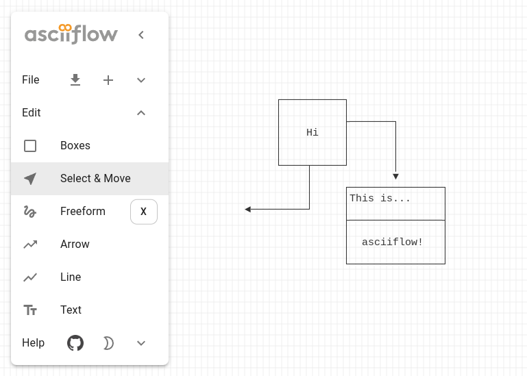

# [asciiflow.com](https://asciiflow.com)

ASCIIFlow is a client-side only web based application for drawing ASCII diagrams. You can use it at [asciiflow.com](https://asciiflow.com).

<p align="center">
  <picture>
    <source media="(prefers-color-scheme: dark)" srcset="./assets/asciiflow-scr-dark.png">
    <source media="(prefers-color-scheme: light)" srcset="./assets/asciiflow-scr-light.png">
    
  </picture>
</p>


## Bug Fix

1. Keyboard shortcut

The alt+1, alt+2 .... keyboard shortcut will cause VS Code switch document editor if ASCIIFlow run as VS Code extension.

To fix it, just add `stopPropagation()` to the `handleKeyDown()` function.

And the refactor code was maked for a code reader's nice mood.

```typescript

  handleKeyDown(event: KeyboardEvent) {

      if (event.altKey) {
        store.altPressed.set(true);
        const toolMap = {
        "1": ToolMode.BOX,
        "2": ToolMode.SELECT,
        "3": ToolMode.FREEFORM,
        "4": ToolMode.ARROWS,
        "5": ToolMode.LINES,
        "6": ToolMode.TEXT,
        }
        if (Object.keys(toolMap).find( it => it == event.key)) {
        event.stopPropagation()
        event.preventDefault()
        store.setToolMode(toolMap[event.key as keyof (typeof toolMap)])
        }
      }
      ...
```


2. Panning operation and TextDraw

Cursor will move forward when user panning canvas by space bar and mouse drag. Just fix the if stament with the ``this.mode != Mode.DRAG``。

```typescript

  handleKeyPress(event: KeyboardEvent) {
    // ...
    if (!event.ctrlKey && !event.metaKey && event.keyCode !== 13 
    **&& this.mode != Mode.DRAG) { // Fixed code**
      store.currentTool.handleKey(
        String.fromCharCode(event.keyCode),
        getModifierKeys(event)
      );
    }
  }
```


## Strokes Updated

* Double Struck [NEW]
* Arrowed       [NEW]
* Dotted        [NEW]
* Strong Struck [NEW]
* Strong Side   [NEW]
* ASCII Extended
* ASCII Basic

Graphs below demonstrate ASCIIFlow Logic Flow. Note that the Unicode (ASCII Extended) output can remap to others.

<details>
  <summary>Double Struck [NEW]</summary>

```
╔══════════════════════╗  ╔════════════════════╗   ╔══════════════════════╗         
║                      ║  ║                    ║   ║                      ║         
║  DesktopController   ║  ║    Controller      ║   ║   IDrawFunction      ║         
║                      ║  ║                    ║   ║ ╔════════════════════╩════════╗
║                      ║  ║                    ║   ║ ║            DrawLine         ║
║  handleMouseMove()═══╬══╬══⇨ handleMove()════╬═══╬═╬⇨ move()                     ║
║                      ║  ║                    ║   ║ ║                             ║
║                      ║ ╔╬══⇨ startDraw() ════╬═══╬═╬⇨ start()                    ║
║  handleMouseDown()═══╬═╣║                    ║   ║ ║                             ║
║                      ║ ╚╬══⇨ startDrag()     ║   ║ ║                      draw() ║
║  handleMouseUp()═════╬╗ ║                    ║   ║ ║                             ║
║                      ║╠═╬═══⇨ endAll()   ════╬═══╬═╬⇨ end()                      ║
║  handleMouseLeave()══╬╝ ║                    ║   ║ ║                             ║
║                      ║  ║  handleKeyDown()══╗║   ║ ║                             ║
║                      ║  ║                   ╠╬═══╬═╬⇨ handleKey()                ║
║                      ║  ║  handleKeyPress()═╝║   ║ ╚════════════════════╦════════╝
╚══════════════════════╝  ╚════════════════════╝   ╚═ ════════════════════╝         
```
</details>


<details>
  <summary>Strong Side [NEW]</summary>

```
┎──────────────────────────────────────────────────────────────────────────────────┒   ┎──────────────────────────────────────┒
┃                                                                                  ┃   ┃                 ┎──────────┒         ┃
┃                                    AsciiFlow Web App                             ┃   ┃                 ┃ DrawBox  ╂─────┒   ┃
┃                                                                                  ┃   ┃                 ┖──────────┚     ┃   ┃
┃ ┎────────────────────┒    ┎────────────────────────────────────────────────────┒ ┃   ┃                 ┎───────────┒    ┃   ┃
┃ ┃ <Drawer>           ┃    ┃ <View> : (...) => <canvas>         ┎───────────────┸─┨   ┃                 ┃ DrawErase─╂────┨   ┃
┃ ┃                    ┃    ┃  ┃                                 ┃ ┎─────────────┒ ┃   ┃                 ┖───────────┚    ┃   ┃
┃ ┃ ┎───────────────┒  ┃    ┃  ┠──useWatchable<T>(fn: () => T): T┃ ┃ onTouchStart┃ ┃   ┃                 ┎──────────────┒ ┃   ┃
┃ ┃ ┃ <ToolControl> ┃  ┃    ┃  ┃   ┃                             ┃ ┠─────────────┨ ┃   ┃                 ┃ DrawFreeform ╂─┨   ┃
┃ ┃ ┖───────────────┚  ┃    ┃  ┃   ┖───trackUsedWatchables(fn)   ┃ ┃ onTouchMove ┃ ┃   ┃                 ┖──────────────┚ ┃   ┃
┃ ┃ ┎────────────────┒ ┃    ┃  ┃                                 ┃ ┠─────────────┨ ┃   ┃                 ┎──────────┒     ┃   ┃
┃ ┃ ┃ <ShortcutChip> ┃ ┃    ┃  ┖──useEffect()                    ┃ ┃ onTouchEnd  ┃ ┃   ┃                 ┃ DrawLine ╂─────┨   ┃
┃ ┃ ┖────────────────┚ ┃    ┃      ┃                             ┃ ┖─────────────┚ ┃   ┃                 ┖──────────┚     ┃   ┃
┃ ┃ ┎────────────┒     ┃    ┃      ┖───render(canvas)            ┃                 ┃   ┃                 ┎──────────┒     ┃   ┃
┃ ┃ ┃ <ToolHelp> ┃     ┃    ┃              ⇧                     ┃ ┎─────────────┒ ┃   ┃                 ┃ DrawMove ╂─────┨   ┃
┃ ┃ ┖────────────┚     ┃    ┃              ┃     Render the grid ┃ ┃ onMouseDown ┃ ┃   ┃                 ┖──────────┚     ┃   ┃
┃ ┃                    ┃    ┃              ┃      ┎┰┰┰┰┰┰┰┰┰┰┰┒  ┃ ┠─────────────┨ ┃   ┃                 ┎──────────┒     ┃   ┃
┃ ┃ ┎────────────────┒ ┃    ┃              ┃      ┠╂╂╂╂╂╂╂╂╂╂╂┨  ┃ ┃ onMouseUp   ┃ ┃   ┃                 ┃ DrawNull ╂─────┨   ┃
┃ ┃ ┃ <ExportDialog> ┃ ┃    ┃              ┃      ┠╂╂╂╂╂╂╂╂╂╂╂┨  ┃ ┠─────────────┨ ┃   ┃  getCursor()    ┖──────────┚     ┃   ┃
┃ ┃ ┃ useWatchable   ┃ ┃    ┃              ┃      ┠╂╂╂╂╂╂╂╂╂╂╂┨  ┃ ┃ onWheel     ┃ ┃   ┃                 ┎────────────┒   ┃   ┃
┃ ┃ ┃┎──────────────┒┃ ┃    ┃          autorun()  ┠╂╂╂╂╂╂╂╂╂╂╂┨  ┃ ┠─────────────┨ ┃   ┃                 ┃ DrawSelect ╂───┨   ┃
┃ ┃ ┃┃ applyConfig()⇦╂─╂─┒  ┃              ⇧      ┠╂╂╂╂╂╂╂╂╂╂╂┨  ┃ ┃ onMouseMove ┠─╂───╂─────⇨ move()    ┖────────────┚   ┃   ┃
┃ ┃ ┃┖──────────────┚┃ ┃ ┃  ┃              ┃      ┠╂╂╂╂╂╂╂╂╂╂╂┨  ┃ ┖─────────────┚ ┃   ┃                 ┎──────────┒     ┃   ┃
┃ ┃ ┖───────⇧────────┚ ┃ ┃  ┃              ┃      ┖┸┸┸┸┸┸┸┸┸┸┸┚  ┃ ┎──────────────┒┃   ┃                 ┃ DrawText ┠─────┨   ┃
┃ ┖─────────╂──────────┚ ┃  ┖──────────────╂─────────────────────┨ ┃handleKeyDown ┃┃   ┃                 ┖──────────┚     ┃   ┃
┖───────────╂────────────╂─────────────────╂─────────────────────┨ ┃             ─╂┸───╂─⇨handleKey() ┎───────────────────⇩──┒┃
    ┎───────┚            ┃                 ┃         ┎───────────┚ ┃handleKeyPress┃┃   ┃              ┃ AbstractDrawFunctio  ┃┃
    ┃                    ┃                 ┃         ┃             ┖──────────────┚┃   ┃              ┖───────────────────┰ ─┚┃
    ┃    ┎───────────────┸─┒      ┎────────┸───────┒ ┃              handleKeyUp    ┃   ┃              ┎────────────────┒  ┃   ┃
    ┃    ┃  ICharacterSet  ┃      ┃ usedWatchables ┃ ┃                             ┃   ┃              ┃ IDrawFunction  ⇦──┚   ┃
    ┃    ┖─⇧───────────────┚      ┖────────⇧───────┚ ┃              endAll() ──────╂───╂────⇨ start() ┖────────────────┚      ┃
    ┃      ┃ ┎─────────────────────┒       ┃         ┃                             ┃   ┃                                      ┃
    ┃      ┠─┨ Double Struck [NEW] ┃       ┃         ┃              startDraw() ───╂───╂──────⇨ end()                         ┃
    ┃      ┃ ┖─────────────────────┚       ┃         ┃                             ┃   ┖────────────────────────┰─────────────┚
    ┃      ┃ ┎─────────────────────┒       ┃         ┃              startDrag()    ┃                            ┃              
    ┃      ┠─┨ Dotted        [NEW] ┃       ┃         ┃                             ┃                            ┃              
    ┃      ┃ ┖─────────────────────┚       ┃         ┃     ┎───────────────────┒   ┃                            ┃              
    ┃      ┃ ┎─────────────────────┒       ┃         ┃ ┎─┰─┨ Controller        ┃⇦──╂──── Keyboard Events        ┃              
    ┃      ┠─┨ Strong Struck [NEW] ┃       ┃         ┃ ┃ ┃ ┖───────────────────┚   ┃                            ┃              
    ┃      ┃ ┖─────────────────────┚       ┃         ┃ ┃ ┃ ┎───────────────────┒   ┃                            ┃              
    ┃      ┃ ┎─────────────────────┒       ┃         ┃ ┃ ┖─┨ TouchController   ┃⇦──╂─────── Touch Events        ┃              
    ┃      ┠─┨ Strong Side   [NEW] ┃       ┃         ┃ ┃   ┖───────────────────┚   ┃                            ┃              
    ┃      ┃ ┖─────────────────────┚       ┃         ┃ ┃   ┎───────────────────┒   ┃                            ┃              
    ┃      ┃ ┎────────────────┒            ┃         ┃ ┖───┨ DesktopController ┃⇦──╂─────── Mouse Events        ┃              
    ┃      ┠─┨ ASCII Extended ┃            ┃         ┃     ┖───────────────────┚   ┃                            ┃              
    ┃      ┃ ┖────────────────┚            ┃         ┖─────────────────────────────┚                            ┃              
    ┃      ┃ ┎────────────────┒            ┃                                                  ┎── paste         ┃              
    ┃      ┖─┨ ASCII Basic    ┃            ┖────────────┒                   ┎───────────────┒ ┃                 ⇩              
    ┃        ┖────────────────┚    ┎────────────────────╂───────────┒       ┃               ┃ ┃      ┎────────────────────────┒
    ┃                              ┃                    ┃         ┎─╂───────╂ layerToText() ┠─┚      ┃  Store                 ┃
    ┃                              ┃   CanvasStore      ┃         ┃ ┃       ┃ textToLayer() ┃        ┃                        ┃
    ┃                              ┃                    ┃         ┃ ┃       ┃               ┃        ┃  watchableValue        ┃
    ┃                              ┃     watchableValue ┃         ┃ ┃       ┖───────────────┚        ┃  ┃                     ┃
    ┃                              ┃     ┃              ┃         ┃ ┃                                ┃  ┠── currentTool       ┃
    ┃        ┎─────────────────────╂───⇨ ┠─ scratch<Layer>        ┃ ╂────────────────────────────────╂─⇨┠── currentCanvas     ┃
┎───╂────────╂────────────────┒    ┃     ┖─ selection<Box>        ┃ ┃                                ┃  ┠── freeformCharacter ┃
┃                             ┃    ┃                              ┃ ┃                                ┃  ┠── selectedToolMode  ┃
┃      ┎────────────┒         ┃    ┃     WatchableAdapter<Layer> :┃ ┃                                ┃  ┠── panning           ┃
┃      ┃ ILayerView ┃         ┃    ┃     ┃                        ┃ ┃                                ┃  ┠── altPressed        ┃
┃      ┖──────⇧─────┚         ┃    ┃     ┠─ persistentCommitted   ┃ ┃  ┎──────────────────────────┒  ┃  ┠── currentCursor     ┃
┃     ┎───────┸───────┒       ┃    ┃     ┠─ committed             ┃ ┃  ┃                          ┃  ┃  ┖── modifierKeys      ┃
┃ ┎───┸─────┒ ┎───────┸───┒   ┃    ┃     ┠─ undoLayers            ┃ ┃  ┃  DrawingId               ┃  ┖────────────────────────┚
┃ ┃  Layer  ┃ ┃ LayerView ┃   ┃    ┃     ┖─ redoLayers            ┃ ┃  ┃                          ┃  ┎────────────────────────┒
┃ ┖─────────┚ ┖───────────┚   ┃    ┃                              ┃ ┃  ┃  type: "local" | "share" ┃  ┃                        ┃
┃                             ┃    ┃   undo()                     ┃ ┃  ┃                          ┃  ┃ Persistent             ┃
┃                             ┃    ┃   redo()                     ┃ ┃  ┃  saveDrawing()    ───────╂─⇨┃ ┎────────────────────┒ ┃
┃  deserialize(value: string)─╂··· ╂─⇨ setScratchLayer(layer) ⇦───┚ ┃  ┃                          ┃  ┃ ┃ localStorage       ┃ ┃
┃                             ┃    ┃   commitScratch()              ┃  ┃  deleteDrawing()─────────╂──╂⇨┃ ┠── getItem(key)   ┃ ┃
┃  apply(layer): [ldo, lundo] ┃    ┃   _route ──────────────────────╂─⇨┃  renameDrawing()─────────╂──╂⇨┃ ┖── setItem(key)   ┃ ┃
┃                             ┃    ┃                                ┃  ┃                          ┃  ┃ ┖────────────────────┚ ┃
┖─────────────────────────────┚    ┖────────────────────────────────┚  ┖──────────────────────────┚  ┖────────────────────────┚
```
</details>


<details>
  <summary>Dotted [NEW]</summary>

```
╒┄┄┄┄┄┄┄┄┄┄┄┄┄┄┄┄┄┄┄┄┄┄┄┄┄┄┄┄┄┄┄┄┄┄┄┄┄┄┄┄┄┄┄┄┄┄┄┄┄┄┄┄┄┄┄┄┄┄┄┄┄┄┄┄┄┄┄┄┄┄┄┄┄┄┄┄┄┄┄┄┄┄╕   ╒┄┄┄┄┄┄┄┄┄┄┄┄┄┄┄┄┄┄┄┄┄┄┄┄┄┄┄┄┄┄┄┄┄┄┄┄┄┄╕
┊                                                                                  ┊   ┊                 ╒┄┄┄┄┄┄┄┄┄┄╕         ┊
┊                                    AsciiFlow Web App                             ┊   ┊                 ┊ DrawBox  ┼┄┄┄┄┄╕   ┊
┊                                                                                  ┊   ┊                 ╘┄┄┄┄┄┄┄┄┄┄╛     ┊   ┊
┊ ╒┄┄┄┄┄┄┄┄┄┄┄┄┄┄┄┄┄┄┄┄╕    ╒┄┄┄┄┄┄┄┄┄┄┄┄┄┄┄┄┄┄┄┄┄┄┄┄┄┄┄┄┄┄┄┄┄┄┄┄┄┄┄┄┄┄┄┄┄┄┄┄┄┄┄┄╕ ┊   ┊                 ╒┄┄┄┄┄┄┄┄┄┄┄╕    ┊   ┊
┊ ┊ <Drawer>           ┊    ┊ <View> : (...) => <canvas>         ╒┄┄┄┄┄┄┄┄┄┄┄┄┄┄┄╧┄╡   ┊                 ┊ DrawErase┄┼┄┄┄┄╡   ┊
┊ ┊                    ┊    ┊  ┊                                 ┊ ╒┄┄┄┄┄┄┄┄┄┄┄┄┄╕ ┊   ┊                 ╘┄┄┄┄┄┄┄┄┄┄┄╛    ┊   ┊
┊ ┊ ╒┄┄┄┄┄┄┄┄┄┄┄┄┄┄┄╕  ┊    ┊  ╞┄┄useWatchable<T>(fn: () => T): T┊ ┊ onTouchStart┊ ┊   ┊                 ╒┄┄┄┄┄┄┄┄┄┄┄┄┄┄╕ ┊   ┊
┊ ┊ ┊ <ToolControl> ┊  ┊    ┊  ┊   ┊                             ┊ ╞┄┄┄┄┄┄┄┄┄┄┄┄┄╡ ┊   ┊                 ┊ DrawFreeform ┼┄╡   ┊
┊ ┊ ╘┄┄┄┄┄┄┄┄┄┄┄┄┄┄┄╛  ┊    ┊  ┊   ╘┄┄┄trackUsedWatchables(fn)   ┊ ┊ onTouchMove ┊ ┊   ┊                 ╘┄┄┄┄┄┄┄┄┄┄┄┄┄┄╛ ┊   ┊
┊ ┊ ╒┄┄┄┄┄┄┄┄┄┄┄┄┄┄┄┄╕ ┊    ┊  ┊                                 ┊ ╞┄┄┄┄┄┄┄┄┄┄┄┄┄╡ ┊   ┊                 ╒┄┄┄┄┄┄┄┄┄┄╕     ┊   ┊
┊ ┊ ┊ <ShortcutChip> ┊ ┊    ┊  ╘┄┄useEffect()                    ┊ ┊ onTouchEnd  ┊ ┊   ┊                 ┊ DrawLine ┼┄┄┄┄┄╡   ┊
┊ ┊ ╘┄┄┄┄┄┄┄┄┄┄┄┄┄┄┄┄╛ ┊    ┊      ┊                             ┊ ╘┄┄┄┄┄┄┄┄┄┄┄┄┄╛ ┊   ┊                 ╘┄┄┄┄┄┄┄┄┄┄╛     ┊   ┊
┊ ┊ ╒┄┄┄┄┄┄┄┄┄┄┄┄╕     ┊    ┊      ╘┄┄┄render(canvas)            ┊                 ┊   ┊                 ╒┄┄┄┄┄┄┄┄┄┄╕     ┊   ┊
┊ ┊ ┊ <ToolHelp> ┊     ┊    ┊              ↑                     ┊ ╒┄┄┄┄┄┄┄┄┄┄┄┄┄╕ ┊   ┊                 ┊ DrawMove ┼┄┄┄┄┄╡   ┊
┊ ┊ ╘┄┄┄┄┄┄┄┄┄┄┄┄╛     ┊    ┊              ┊     Render the grid ┊ ┊ onMouseDown ┊ ┊   ┊                 ╘┄┄┄┄┄┄┄┄┄┄╛     ┊   ┊
┊ ┊                    ┊    ┊              ┊      ╒╤╤╤╤╤╤╤╤╤╤╤╕  ┊ ╞┄┄┄┄┄┄┄┄┄┄┄┄┄╡ ┊   ┊                 ╒┄┄┄┄┄┄┄┄┄┄╕     ┊   ┊
┊ ┊ ╒┄┄┄┄┄┄┄┄┄┄┄┄┄┄┄┄╕ ┊    ┊              ┊      ╞┼┼┼┼┼┼┼┼┼┼┼╡  ┊ ┊ onMouseUp   ┊ ┊   ┊                 ┊ DrawNull ┼┄┄┄┄┄╡   ┊
┊ ┊ ┊ <ExportDialog> ┊ ┊    ┊              ┊      ╞┼┼┼┼┼┼┼┼┼┼┼╡  ┊ ╞┄┄┄┄┄┄┄┄┄┄┄┄┄╡ ┊   ┊  getCursor()    ╘┄┄┄┄┄┄┄┄┄┄╛     ┊   ┊
┊ ┊ ┊ useWatchable   ┊ ┊    ┊              ┊      ╞┼┼┼┼┼┼┼┼┼┼┼╡  ┊ ┊ onWheel     ┊ ┊   ┊                 ╒┄┄┄┄┄┄┄┄┄┄┄┄╕   ┊   ┊
┊ ┊ ┊╒┄┄┄┄┄┄┄┄┄┄┄┄┄┄╕┊ ┊    ┊          autorun()  ╞┼┼┼┼┼┼┼┼┼┼┼╡  ┊ ╞┄┄┄┄┄┄┄┄┄┄┄┄┄╡ ┊   ┊                 ┊ DrawSelect ┼┄┄┄╡   ┊
┊ ┊ ┊┊ applyConfig()←┼┄┼┄╕  ┊              ↑      ╞┼┼┼┼┼┼┼┼┼┼┼╡  ┊ ┊ onMouseMove ╞┄┼┄┄┄┼┄┄┄┄┄→ move()    ╘┄┄┄┄┄┄┄┄┄┄┄┄╛   ┊   ┊
┊ ┊ ┊╘┄┄┄┄┄┄┄┄┄┄┄┄┄┄╛┊ ┊ ┊  ┊              ┊      ╞┼┼┼┼┼┼┼┼┼┼┼╡  ┊ ╘┄┄┄┄┄┄┄┄┄┄┄┄┄╛ ┊   ┊                 ╒┄┄┄┄┄┄┄┄┄┄╕     ┊   ┊
┊ ┊ ╘┄┄┄┄┄┄┄↑┄┄┄┄┄┄┄┄╛ ┊ ┊  ┊              ┊      ╘╧╧╧╧╧╧╧╧╧╧╧╛  ┊ ╒┄┄┄┄┄┄┄┄┄┄┄┄┄┄╕┊   ┊                 ┊ DrawText ╞┄┄┄┄┄╡   ┊
┊ ╘┄┄┄┄┄┄┄┄┄┼┄┄┄┄┄┄┄┄┄┄╛ ┊  ╘┄┄┄┄┄┄┄┄┄┄┄┄┄┄┼┄┄┄┄┄┄┄┄┄┄┄┄┄┄┄┄┄┄┄┄┄╡ ┊handleKeyDown ┊┊   ┊                 ╘┄┄┄┄┄┄┄┄┄┄╛     ┊   ┊
╘┄┄┄┄┄┄┄┄┄┄┄┼┄┄┄┄┄┄┄┄┄┄┄┄┼┄┄┄┄┄┄┄┄┄┄┄┄┄┄┄┄┄┼┄┄┄┄┄┄┄┄┄┄┄┄┄┄┄┄┄┄┄┄┄╡ ┊             ┄┼╧┄┄┄┼┄→handleKey() ╒┄┄┄┄┄┄┄┄┄┄┄┄┄┄┄┄┄┄┄↓┄┄╕┊
    ╒┄┄┄┄┄┄┄╛            ┊                 ┊         ╒┄┄┄┄┄┄┄┄┄┄┄╛ ┊handleKeyPress┊┊   ┊              ┊ AbstractDrawFunctio  ┊┊
    ┊                    ┊                 ┊         ┊             ╘┄┄┄┄┄┄┄┄┄┄┄┄┄┄╛┊   ┊              ╘┄┄┄┄┄┄┄┄┄┄┄┄┄┄┄┄┄┄┄╤ ┄╛┊
    ┊    ╒┄┄┄┄┄┄┄┄┄┄┄┄┄┄┄╧┄╕      ╒┄┄┄┄┄┄┄┄╧┄┄┄┄┄┄┄╕ ┊              handleKeyUp    ┊   ┊              ╒┄┄┄┄┄┄┄┄┄┄┄┄┄┄┄┄╕  ┊   ┊
    ┊    ┊  ICharacterSet  ┊      ┊ usedWatchables ┊ ┊                             ┊   ┊              ┊ IDrawFunction  ←┄┄╛   ┊
    ┊    ╘┄↑┄┄┄┄┄┄┄┄┄┄┄┄┄┄┄╛      ╘┄┄┄┄┄┄┄┄↑┄┄┄┄┄┄┄╛ ┊              endAll() ┄┄┄┄┄┄┼┄┄┄┼┄┄┄┄→ start() ╘┄┄┄┄┄┄┄┄┄┄┄┄┄┄┄┄╛      ┊
    ┊      ┊ ╒┄┄┄┄┄┄┄┄┄┄┄┄┄┄┄┄┄┄┄┄┄╕       ┊         ┊                             ┊   ┊                                      ┊
    ┊      ╞┄╡ Double Struck [NEW] ┊       ┊         ┊              startDraw() ┄┄┄┼┄┄┄┼┄┄┄┄┄┄→ end()                         ┊
    ┊      ┊ ╘┄┄┄┄┄┄┄┄┄┄┄┄┄┄┄┄┄┄┄┄┄╛       ┊         ┊                             ┊   ╘┄┄┄┄┄┄┄┄┄┄┄┄┄┄┄┄┄┄┄┄┄┄┄┄╤┄┄┄┄┄┄┄┄┄┄┄┄┄╛
    ┊      ┊ ╒┄┄┄┄┄┄┄┄┄┄┄┄┄┄┄┄┄┄┄┄┄╕       ┊         ┊              startDrag()    ┊                            ┊              
    ┊      ╞┄╡ Dotted        [NEW] ┊       ┊         ┊                             ┊                            ┊              
    ┊      ┊ ╘┄┄┄┄┄┄┄┄┄┄┄┄┄┄┄┄┄┄┄┄┄╛       ┊         ┊     ╒┄┄┄┄┄┄┄┄┄┄┄┄┄┄┄┄┄┄┄╕   ┊                            ┊              
    ┊      ┊ ╒┄┄┄┄┄┄┄┄┄┄┄┄┄┄┄┄┄┄┄┄┄╕       ┊         ┊ ╒┄╤┄╡ Controller        ┊←┄┄┼┄┄┄┄ Keyboard Events        ┊              
    ┊      ╞┄╡ Strong Struck [NEW] ┊       ┊         ┊ ┊ ┊ ╘┄┄┄┄┄┄┄┄┄┄┄┄┄┄┄┄┄┄┄╛   ┊                            ┊              
    ┊      ┊ ╘┄┄┄┄┄┄┄┄┄┄┄┄┄┄┄┄┄┄┄┄┄╛       ┊         ┊ ┊ ┊ ╒┄┄┄┄┄┄┄┄┄┄┄┄┄┄┄┄┄┄┄╕   ┊                            ┊              
    ┊      ┊ ╒┄┄┄┄┄┄┄┄┄┄┄┄┄┄┄┄┄┄┄┄┄╕       ┊         ┊ ┊ ╘┄╡ TouchController   ┊←┄┄┼┄┄┄┄┄┄┄ Touch Events        ┊              
    ┊      ╞┄╡ Strong Side   [NEW] ┊       ┊         ┊ ┊   ╘┄┄┄┄┄┄┄┄┄┄┄┄┄┄┄┄┄┄┄╛   ┊                            ┊              
    ┊      ┊ ╘┄┄┄┄┄┄┄┄┄┄┄┄┄┄┄┄┄┄┄┄┄╛       ┊         ┊ ┊   ╒┄┄┄┄┄┄┄┄┄┄┄┄┄┄┄┄┄┄┄╕   ┊                            ┊              
    ┊      ┊ ╒┄┄┄┄┄┄┄┄┄┄┄┄┄┄┄┄╕            ┊         ┊ ╘┄┄┄╡ DesktopController ┊←┄┄┼┄┄┄┄┄┄┄ Mouse Events        ┊              
    ┊      ╞┄╡ ASCII Extended ┊            ┊         ┊     ╘┄┄┄┄┄┄┄┄┄┄┄┄┄┄┄┄┄┄┄╛   ┊                            ┊              
    ┊      ┊ ╘┄┄┄┄┄┄┄┄┄┄┄┄┄┄┄┄╛            ┊         ╘┄┄┄┄┄┄┄┄┄┄┄┄┄┄┄┄┄┄┄┄┄┄┄┄┄┄┄┄┄╛                            ┊              
    ┊      ┊ ╒┄┄┄┄┄┄┄┄┄┄┄┄┄┄┄┄╕            ┊                                                  ╒┄┄ paste         ┊              
    ┊      ╘┄╡ ASCII Basic    ┊            ╘┄┄┄┄┄┄┄┄┄┄┄┄╕                   ╒┄┄┄┄┄┄┄┄┄┄┄┄┄┄┄╕ ┊                 ↓              
    ┊        ╘┄┄┄┄┄┄┄┄┄┄┄┄┄┄┄┄╛    ╒┄┄┄┄┄┄┄┄┄┄┄┄┄┄┄┄┄┄┄┄┼┄┄┄┄┄┄┄┄┄┄┄╕       ┊               ┊ ┊      ╒┄┄┄┄┄┄┄┄┄┄┄┄┄┄┄┄┄┄┄┄┄┄┄┄╕
    ┊                              ┊                    ┊         ╒┄┼┄┄┄┄┄┄┄┼ layerToText() ╞┄╛      ┊  Store                 ┊
    ┊                              ┊   CanvasStore      ┊         ┊ ┊       ┊ textToLayer() ┊        ┊                        ┊
    ┊                              ┊                    ┊         ┊ ┊       ┊               ┊        ┊  watchableValue        ┊
    ┊                              ┊     watchableValue ┊         ┊ ┊       ╘┄┄┄┄┄┄┄┄┄┄┄┄┄┄┄╛        ┊  ┊                     ┊
    ┊                              ┊     ┊              ┊         ┊ ┊                                ┊  ╞┄┄ currentTool       ┊
    ┊        ╒┄┄┄┄┄┄┄┄┄┄┄┄┄┄┄┄┄┄┄┄┄┼┄┄┄→ ╞┄ scratch<Layer>        ┊ ┼┄┄┄┄┄┄┄┄┄┄┄┄┄┄┄┄┄┄┄┄┄┄┄┄┄┄┄┄┄┄┄┄┼┄→╞┄┄ currentCanvas     ┊
╒┄┄┄┼┄┄┄┄┄┄┄┄┼┄┄┄┄┄┄┄┄┄┄┄┄┄┄┄┄╕    ┊     ╘┄ selection<Box>        ┊ ┊                                ┊  ╞┄┄ freeformCharacter ┊
┊                             ┊    ┊                              ┊ ┊                                ┊  ╞┄┄ selectedToolMode  ┊
┊      ╒┄┄┄┄┄┄┄┄┄┄┄┄╕         ┊    ┊     WatchableAdapter<Layer> :┊ ┊                                ┊  ╞┄┄ panning           ┊
┊      ┊ ILayerView ┊         ┊    ┊     ┊                        ┊ ┊                                ┊  ╞┄┄ altPressed        ┊
┊      ╘┄┄┄┄┄┄↑┄┄┄┄┄╛         ┊    ┊     ╞┄ persistentCommitted   ┊ ┊  ╒┄┄┄┄┄┄┄┄┄┄┄┄┄┄┄┄┄┄┄┄┄┄┄┄┄┄╕  ┊  ╞┄┄ currentCursor     ┊
┊     ╒┄┄┄┄┄┄┄╧┄┄┄┄┄┄┄╕       ┊    ┊     ╞┄ committed             ┊ ┊  ┊                          ┊  ┊  ╘┄┄ modifierKeys      ┊
┊ ╒┄┄┄╧┄┄┄┄┄╕ ╒┄┄┄┄┄┄┄╧┄┄┄╕   ┊    ┊     ╞┄ undoLayers            ┊ ┊  ┊  DrawingId               ┊  ╘┄┄┄┄┄┄┄┄┄┄┄┄┄┄┄┄┄┄┄┄┄┄┄┄╛
┊ ┊  Layer  ┊ ┊ LayerView ┊   ┊    ┊     ╘┄ redoLayers            ┊ ┊  ┊                          ┊  ╒┄┄┄┄┄┄┄┄┄┄┄┄┄┄┄┄┄┄┄┄┄┄┄┄╕
┊ ╘┄┄┄┄┄┄┄┄┄╛ ╘┄┄┄┄┄┄┄┄┄┄┄╛   ┊    ┊                              ┊ ┊  ┊  type: "local" | "share" ┊  ┊                        ┊
┊                             ┊    ┊   undo()                     ┊ ┊  ┊                          ┊  ┊ Persistent             ┊
┊                             ┊    ┊   redo()                     ┊ ┊  ┊  saveDrawing()    ┄┄┄┄┄┄┄┼┄→┊ ╒┄┄┄┄┄┄┄┄┄┄┄┄┄┄┄┄┄┄┄┄╕ ┊
┊  deserialize(value: string)┄┼··· ┼┄→ setScratchLayer(layer) ←┄┄┄╛ ┊  ┊                          ┊  ┊ ┊ localStorage       ┊ ┊
┊                             ┊    ┊   commitScratch()              ┊  ┊  deleteDrawing()┄┄┄┄┄┄┄┄┄┼┄┄┼→┊ ╞┄┄ getItem(key)   ┊ ┊
┊  apply(layer): [ldo, lundo] ┊    ┊   _route ┄┄┄┄┄┄┄┄┄┄┄┄┄┄┄┄┄┄┄┄┄┄┼┄→┊  renameDrawing()┄┄┄┄┄┄┄┄┄┼┄┄┼→┊ ╘┄┄ setItem(key)   ┊ ┊
┊                             ┊    ┊                                ┊  ┊                          ┊  ┊ ╘┄┄┄┄┄┄┄┄┄┄┄┄┄┄┄┄┄┄┄┄╛ ┊
╘┄┄┄┄┄┄┄┄┄┄┄┄┄┄┄┄┄┄┄┄┄┄┄┄┄┄┄┄┄╛    ╘┄┄┄┄┄┄┄┄┄┄┄┄┄┄┄┄┄┄┄┄┄┄┄┄┄┄┄┄┄┄┄┄╛  ╘┄┄┄┄┄┄┄┄┄┄┄┄┄┄┄┄┄┄┄┄┄┄┄┄┄┄╛  ╘┄┄┄┄┄┄┄┄┄┄┄┄┄┄┄┄┄┄┄┄┄┄┄┄╛
```

</details>


<details>
  <summary>ASCII Extended</summary>

```
┌──────────────────────────────────────────────────────────────────────────────────┐   ┌──────────────────────────────────────┐
│                                                                                  │   │                 ┌──────────┐         │
│                                    AsciiFlow Web App                             │   │                 │ DrawBox  ┼─────┐   │
│                                                                                  │   │                 └──────────┘     │   │
│ ┌────────────────────┐    ┌────────────────────────────────────────────────────┐ │   │                 ┌───────────┐    │   │
│ │ <Drawer>           │    │ <View> : (...) => <canvas>         ┌───────────────┴─┤   │                 │ DrawErase─┼────┤   │
│ │                    │    │  │                                 │ ┌─────────────┐ │   │                 └───────────┘    │   │
│ │ ┌───────────────┐  │    │  ├──useWatchable<T>(fn: () => T): T│ │ onTouchStart│ │   │                 ┌──────────────┐ │   │
│ │ │ <ToolControl> │  │    │  │   │                             │ ├─────────────┤ │   │                 │ DrawFreeform ┼─┤   │
│ │ └───────────────┘  │    │  │   └───trackUsedWatchables(fn)   │ │ onTouchMove │ │   │                 └──────────────┘ │   │
│ │ ┌────────────────┐ │    │  │                                 │ ├─────────────┤ │   │                 ┌──────────┐     │   │
│ │ │ <ShortcutChip> │ │    │  └──useEffect()                    │ │ onTouchEnd  │ │   │                 │ DrawLine ┼─────┤   │
│ │ └────────────────┘ │    │      │                             │ └─────────────┘ │   │                 └──────────┘     │   │
│ │ ┌────────────┐     │    │      └───render(canvas)            │                 │   │                 ┌──────────┐     │   │
│ │ │ <ToolHelp> │     │    │              ▲                     │ ┌─────────────┐ │   │                 │ DrawMove ┼─────┤   │
│ │ └────────────┘     │    │              │     Render the grid │ │ onMouseDown │ │   │                 └──────────┘     │   │
│ │                    │    │              │      ┌┬┬┬┬┬┬┬┬┬┬┬┐  │ ├─────────────┤ │   │                 ┌──────────┐     │   │
│ │ ┌────────────────┐ │    │              │      ├┼┼┼┼┼┼┼┼┼┼┼┤  │ │ onMouseUp   │ │   │                 │ DrawNull ┼─────┤   │
│ │ │ <ExportDialog> │ │    │              │      ├┼┼┼┼┼┼┼┼┼┼┼┤  │ ├─────────────┤ │   │  getCursor()    └──────────┘     │   │
│ │ │ useWatchable   │ │    │              │      ├┼┼┼┼┼┼┼┼┼┼┼┤  │ │ onWheel     │ │   │                 ┌────────────┐   │   │
│ │ │┌──────────────┐│ │    │          autorun()  ├┼┼┼┼┼┼┼┼┼┼┼┤  │ ├─────────────┤ │   │                 │ DrawSelect ┼───┤   │
│ │ ││ applyConfig()◄┼─┼─┐  │              ▲      ├┼┼┼┼┼┼┼┼┼┼┼┤  │ │ onMouseMove ├─┼───┼─────► move()    └────────────┘   │   │
│ │ │└──────────────┘│ │ │  │              │      ├┼┼┼┼┼┼┼┼┼┼┼┤  │ └─────────────┘ │   │                 ┌──────────┐     │   │
│ │ └───────▲────────┘ │ │  │              │      └┴┴┴┴┴┴┴┴┴┴┴┘  │ ┌──────────────┐│   │                 │ DrawText ├─────┤   │
│ └─────────┼──────────┘ │  └──────────────┼─────────────────────┤ │handleKeyDown ││   │                 └──────────┘     │   │
└───────────┼────────────┼─────────────────┼─────────────────────┤ │             ─┼┴───┼─►handleKey() ┌───────────────────▼──┐│
    ┌───────┘            │                 │         ┌───────────┘ │handleKeyPress││   │              │ AbstractDrawFunctio  ││
    │                    │                 │         │             └──────────────┘│   │              └───────────────────┬ ─┘│
    │    ┌───────────────┴─┐      ┌────────┴───────┐ │              handleKeyUp    │   │              ┌────────────────┐  │   │
    │    │  ICharacterSet  │      │ usedWatchables │ │                             │   │              │ IDrawFunction  ◄──┘   │
    │    └─▲───────────────┘      └────────▲───────┘ │              endAll() ──────┼───┼────► start() └────────────────┘      │
    │      │ ┌─────────────────────┐       │         │                             │   │                                      │
    │      ├─┤ Double Struck [NEW] │       │         │              startDraw() ───┼───┼──────► end()                         │
    │      │ └─────────────────────┘       │         │                             │   └────────────────────────┬─────────────┘
    │      │ ┌─────────────────────┐       │         │              startDrag()    │                            │              
    │      ├─┤ Dotted        [NEW] │       │         │                             │                            │              
    │      │ └─────────────────────┘       │         │     ┌───────────────────┐   │                            │              
    │      │ ┌─────────────────────┐       │         │ ┌─┬─┤ Controller        │◄──┼──── Keyboard Events        │              
    │      ├─┤ Strong Struck [NEW] │       │         │ │ │ └───────────────────┘   │                            │              
    │      │ └─────────────────────┘       │         │ │ │ ┌───────────────────┐   │                            │              
    │      │ ┌─────────────────────┐       │         │ │ └─┤ TouchController   │◄──┼─────── Touch Events        │              
    │      ├─┤ Strong Side   [NEW] │       │         │ │   └───────────────────┘   │                            │              
    │      │ └─────────────────────┘       │         │ │   ┌───────────────────┐   │                            │              
    │      │ ┌────────────────┐            │         │ └───┤ DesktopController │◄──┼─────── Mouse Events        │              
    │      ├─┤ ASCII Extended │            │         │     └───────────────────┘   │                            │              
    │      │ └────────────────┘            │         └─────────────────────────────┘                            │              
    │      │ ┌────────────────┐            │                                                  ┌── paste         │              
    │      └─┤ ASCII Basic    │            └────────────┐                   ┌───────────────┐ │                 ▼              
    │        └────────────────┘    ┌────────────────────┼───────────┐       │               │ │      ┌────────────────────────┐
    │                              │                    │         ┌─┼───────┼ layerToText() ├─┘      │  Store                 │
    │                              │   CanvasStore      │         │ │       │ textToLayer() │        │                        │
    │                              │                    │         │ │       │               │        │  watchableValue        │
    │                              │     watchableValue │         │ │       └───────────────┘        │  │                     │
    │                              │     │              │         │ │                                │  ├── currentTool       │
    │        ┌─────────────────────┼───► ├─ scratch<Layer>        │ ┼────────────────────────────────┼─►├── currentCanvas     │
┌───┼────────┼────────────────┐    │     └─ selection<Box>        │ │                                │  ├── freeformCharacter │
│                             │    │                              │ │                                │  ├── selectedToolMode  │
│      ┌────────────┐         │    │     WatchableAdapter<Layer> :│ │                                │  ├── panning           │
│      │ ILayerView │         │    │     │                        │ │                                │  ├── altPressed        │
│      └──────▲─────┘         │    │     ├─ persistentCommitted   │ │  ┌──────────────────────────┐  │  ├── currentCursor     │
│     ┌───────┴───────┐       │    │     ├─ committed             │ │  │                          │  │  └── modifierKeys      │
│ ┌───┴─────┐ ┌───────┴───┐   │    │     ├─ undoLayers            │ │  │  DrawingId               │  └────────────────────────┘
│ │  Layer  │ │ LayerView │   │    │     └─ redoLayers            │ │  │                          │  ┌────────────────────────┐
│ └─────────┘ └───────────┘   │    │                              │ │  │  type: "local" | "share" │  │                        │
│                             │    │   undo()                     │ │  │                          │  │ Persistent             │
│                             │    │   redo()                     │ │  │  saveDrawing()    ───────┼─►│ ┌────────────────────┐ │
│  deserialize(value: string)─┼··· ┼─► setScratchLayer(layer) ◄───┘ │  │                          │  │ │ localStorage       │ │
│                             │    │   commitScratch()              │  │  deleteDrawing()─────────┼──┼►│ ├── getItem(key)   │ │
│  apply(layer): [ldo, lundo] │    │   _route ──────────────────────┼─►│  renameDrawing()─────────┼──┼►│ └── setItem(key)   │ │
│                             │    │                                │  │                          │  │ └────────────────────┘ │
└─────────────────────────────┘    └────────────────────────────────┘  └──────────────────────────┘  └────────────────────────┘
```
</details>


## Contributing

### Installation

ASCIIFlow is built with [Bazel](https://docs.bazel.build/versions/4.0.0/getting-started.html).
Bazel is most easily installed to the correct version through [Bazelisk](https://github.com/bazelbuild/bazelisk). See `.bazelversion` for the correct version if you aren't using Bazelisk.

```
npm install -g @bazel/bazelisk
yarn global add @bazel/bazelisk
```

For development, ibazel is also a very useful tool to help with automatic rebuilding and reloading.

```
npm install -g @bazel/ibazel
yarn global add @bazel/ibazel
```

### Running ASCIIFlow locally

After installation of Bazel/Bazelisk, you can run ASCIIFlow locally with:

```
ibazel run client:devserver
```

Or without ibazel (won't do live reloading):

```
bazel run client:devserver
```

